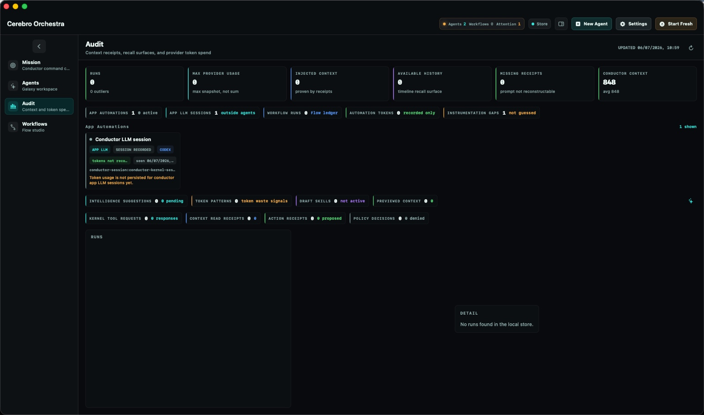
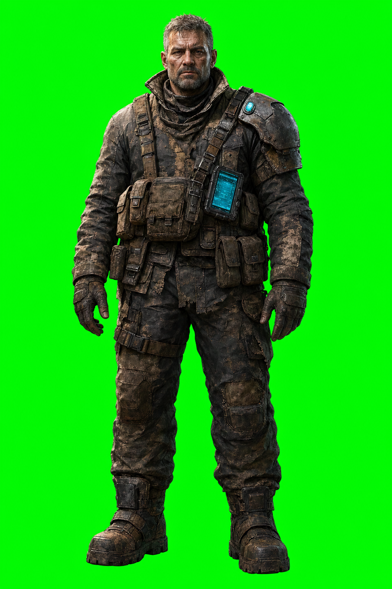

Most work disappears with perfect manners. A terminal closes, a model forgets, a branch sits three directories down wearing a name like worktree-agent-a885923f9e520bc4f, and by Tuesday the whole thing has the emotional status of a receipt that went through the wash. The code may still exist. The reason has become soup. This week I kept arriving at the same problem through four different doors: how to make work leave a body behind.

## The newsletter catches itself writing

This is issue one, which means the newsletter pipeline is currently using the newsletter to prove that the newsletter pipeline exists. There are healthier hobbies.

Twenty-three commits built the machine: git activity with the day-job repos excluded, KB clippings, daily notes, ISO-week state, first-run defaults, screenshot collection, an approvals inbox, publishing wrappers, and the prompt contract that handed all of it to the machine now pretending to be me. Three more put a newsletter index, issue template, content source, and nav entry into the portfolio. The draft still stops at a gate, because I do want automation, I just do not want to wake up on Sunday and discover that a robot has written 1,700 words about my spiritual relationship with package-lock.json.

This issue is the first animal through the pipe. The system can find the facts, carry a voice reference, assemble the week, and hand me a draft. It cannot decide that something worth saying has been said. That is the boundary.

## The method survives the model

Fable's access window was closing, so I spent the last stretch extracting the way we had been working into a set of portable plugins: fable-method, rehydrate, marketing-ops, handoff, then a second research wave for open threads and architecture. The central rule is painfully simple: evidence before assertion. Read the actual file, run the actual thing, look at what happened, and only then announce that reality has agreed with you.

The KB needed the same treatment. I added explicit worker runtime profiles, closed scheduling races in the design, raised an ingest ceiling, repaired dead feeds, added retry behavior, and refreshed a brain index that had quietly frozen on July 4. A second brain that silently stopped remembering four days ago is not a second brain. It is a highly literate houseplant.

I am still technically on paternity leave, so time currently arrives in droplets of around 11 to 43 minutes and sometimes smells like milk, which has made durable handoffs feel less like architecture and more like basic plumbing.

The Fable handoff and the KB reliability work are one project wearing two coats. Judgment has to survive the session that produced it. Otherwise every new model wakes up in the same hotel room, sees the blood on the carpet, and has to reconstruct the wedding.

## Give the agent a desk

That same idea moved into Cerebro Orchestra. Workflows can now publish opted-in artifacts and project workers can publish successful reports as project documents, with explicit write authority, through the kernel's tool boundary. The sentence is boring and I trust boring sentences near permissions.

Until now a run could finish successfully while its most useful output remained trapped in the transcript, glowing somewhere behind 900 lines of tool calls and increasingly desperate status messages. Now the report can become a project-visible artifact with a known author and a governed route into the workspace. A completed run that leaves nothing you can find later is a ghost wearing a Jira lanyard.

At the same time, the Mission Sphere started separating its body from its behavior: presentation geometry, effective-center projection, a skin-agnostic interaction layer. The app is gaining a nervous system at exactly the moment its agents are learning to file paperwork, which is probably how biology happened too.

## A quartermaster with a memory

Sector Zero took the same argument and gave it bloom, plasma, and a hostile amount of machinery. The week brought fixed-timestep simulation, audit and input fixes across six modes, boarding repairs, per-scene post-processing, safer sprite classification, alpha cleanup for the pale halos that make every cutout look haunted, and a faction-standing ledger that changes prices, greetings, and whether someone refuses to deal with you.

The first live asset pilot generated a quartermaster with Codex image generation and then ran him through BiRefNet locally, which sounds like a customs process for a man who has committed space tax fraud. It cost nothing. More importantly, it produced a repeatable pipe instead of one lucky picture.

And the faction ledger is the small change that makes the whole world heavier. The game remembers, so the player begins to matter.

The object underneath all of this is a witness. Not consciousness, not a synthetic soul, not one of those chrome humanoids staring into drizzle while a cello explains death. Something smaller and much harder to lose: a place where intention survives the window closing. A folder can do it. A receipt can do it. A faction ledger can do it. Somewhere under the floorboards there is now a little mechanical clerk with a clipboard and a laser pistol, writing down what happened while the rest of us were busy forgetting.

Anyways, the quartermaster is waiting.
