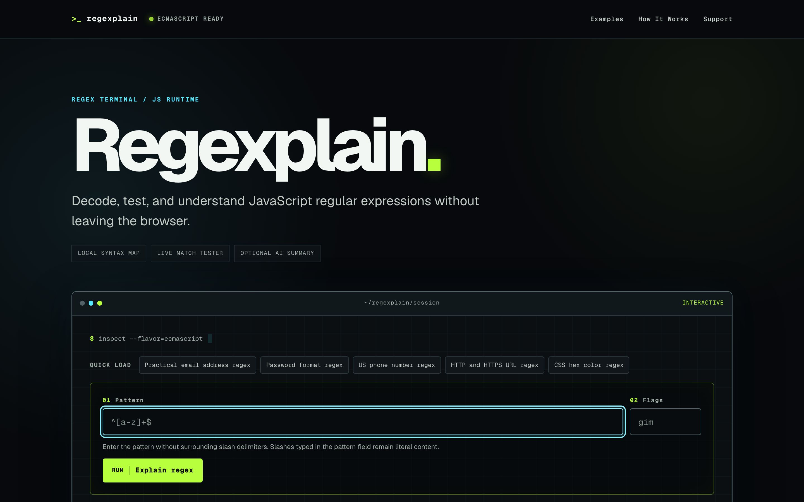
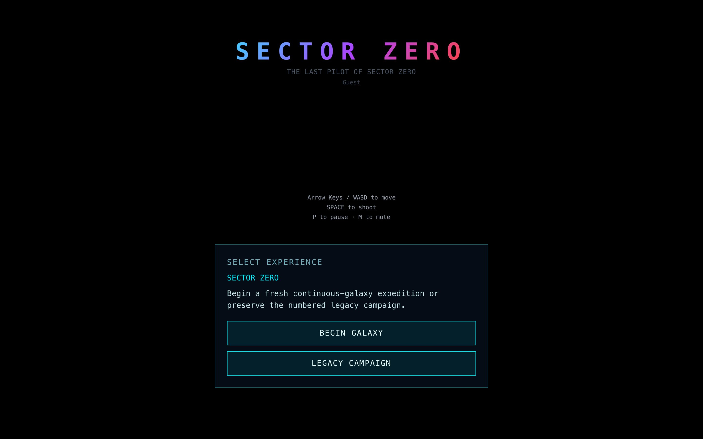

The runtime is where diagrams go to get food poisoning.

On paper an agent has a network, a cache, a home directory, a model, a budget, a lovely little permission number that says it may stride into the world like God carrying npm. Then Finder launches it from `/`, Node falls out of PATH, stdin points into the void, two resumed runs share an ID, and an audio file turns out to be a legal document wearing a waveform. None of this is architecture until the stupid details agree.

I spent most of the week teaching systems to say where they were standing. I was still on paternity leave, so this happened between baby maintenance and the noon Spanish ritual, which is probably the correct environment for learning that no process owns a clean room.

## Give the agent a floor

Cerebro’s capability levels had become reasonably good at describing what an agent was allowed to do, but permission is not the same as a usable environment. An L5 Codex agent could have network access and still lack a writable package cache. Claude could be authorized to run and still inherit a PATH where Node had apparently gone to live with another family. Agents launched from the macOS app could wake up in `/`, homeless in the most technically accurate sense, while child processes without stdin waited beside a pipe that would never contain water.

So the runtime became literal. Higher-authority agents received network access and writable caches. Login-shell PATH enrichment reached every provider. Claude inherited the Node path it actually needed. Agents without a configured home moved into per-agent scratch space, and processes that should never expect input were attached to `/dev/null` instead of a dead promise. When an agent reaches the edge of its authority, the emerging rule is equally physical: ask, park, and resume in place after a person opens the door.

The same small humiliation appeared in the KB. Its scheduled morning ingest was alive, the Codex binary was alive, and launchd could not find the NVM-installed executable because scheduled processes inhabit a colder, emptier universe than the terminal where you tested them. The fix was not intelligence. It was a path.

The machine did not become smarter. It found the floor.

## The crawler is an unusually dull customer

[Regexplain](https://www.regexplain.cc/) and [BotBattle](https://www.botbattle.cc/) had the opposite problem. Humans could open the tools, wait for JavaScript, and understand what had arrived. A crawler saw a loading shell, some vague metadata, and the digital equivalent of a shopkeeper shouting through a locked door that the shop was technically open.

So Regexplain became a proper terminal workbench with permanent homepage copy, worked example pages, safer syntax maps, and stale AI responses that are ignored instead of allowed to overwrite the present. BotBattle moved provider content onto the server, added a crawlable homepage, discovery metadata, a social card, and labels for the controls that previously relied on visual guesswork.

This is not glamorous SEO perfume. The tools learned to introduce themselves before asking the visitor to perform them.

## A usage number is not a receipt

Usage telemetry looks like arithmetic until two providers disagree about what a number means. Claude exposes cache and context semantics. Codex produces per-session deltas. Plugins and workers can run more than once, the Conductor spends tokens of its own, and a recap that overwrites yesterday’s value is not a measurement, it is a tiny administrative fire.

The dangerous discovery was that resumed runs could share an ID and silently lose recap data. The existing deduplication idea sounded tidy, but there was no replay path, so deduplication was really deletion wearing glasses. The design had to change: preserve provider-native meaning, accumulate fields that are genuinely additive, record the source of a context window, and stop pretending one identifier proves two observations are the same event.

The meter must survive the machine it measures. Otherwise the dashboard is a horoscope with decimals.

## The Reel carries paperwork

The Social producer crossed a similar line. A Reel is not merely a rendered video. It belongs to a brand, an Instagram account, an approved engine, a cover frame, an audio file, a licence, a production attempt, and sometimes a retained staging directory containing the perfectly valid work a timeout tried to throw away.

The queue can now expose an approved-audio library, let me choose and preview a track, apply it without rendering the whole Reel again, and record what the exported file actually carries. A licence guard exists because a good song discovered on a hard drive is not automatically a song the publishing system has authority to use. Cover-frame selection became explicit instead of letting Instagram choose the accidental black rectangle by divination. Separate brands gained separate account ownership, and failed imports can recover from retained staging when recovery is real.

I like this version of automation more than the magic-demo version. The output knows whose it is, what it contains, where it may go, and which evidence grants it passage.

## The map remembers where you were

I wrote last time about Sector Zero beginning to remember. The continuation is that memory now has geography.

The Atlas moved from replacement diagram to game authority through stable generated cells, isolated save state, supply-bound routes, idempotent travel commitments, located encounter launches, replay-validated outcomes, and hydration rules that refuse to let browser persistence sprint ahead of the state it is supposed to preserve. Unresolved outcomes stay locked. Disguised journals get rejected. A fresh save keeps its full shape instead of slowly shedding organs every time an old serializer meets a new world.

That is what makes a map heavy. A dot is no longer somewhere you can click. It is where you departed from, what the journey cost, which encounter happened there, what evidence came back, and whether the galaxy is allowed to believe you.

None of these systems became more impressive by learning where Node lives, introducing themselves to a crawler, refusing a false duplicate, carrying a music licence, or distrusting a half-hydrated save. They became believable.

A system becomes believable when it can tell you where it is, what it spent, which account it will touch, what file it is carrying, what happened before it woke up, and when the next step belongs to a person.

The diagram gets to float. The runtime has to wear shoes.
