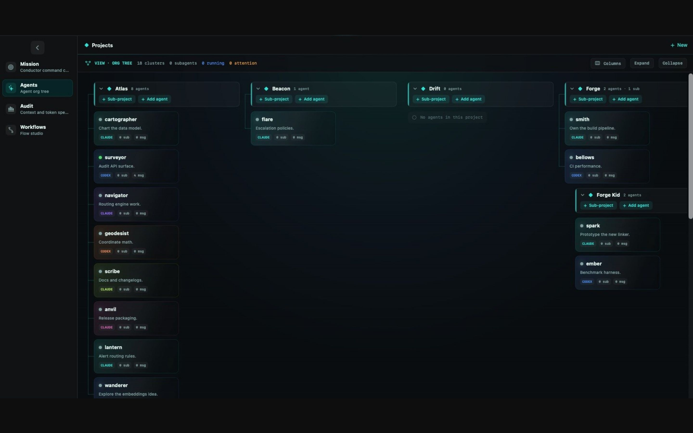
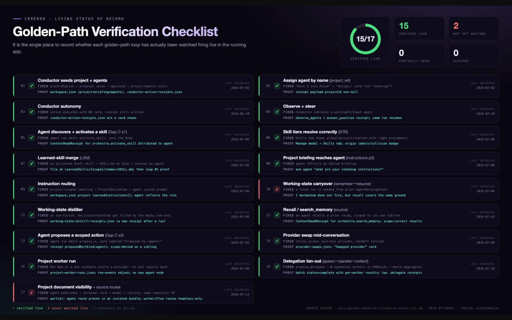

Every noun in software is lying until somebody checks its paperwork.

“Provider” is a nice noun. It sits in a picker wearing one clean little label, Claude or Codex, and suggests that the rest of the universe has been settled. But the noun may contain a model, a process, a session, a working directory, an environment, a tool surface, a cache, a set of permissions, three attachments with complicated childhoods, and a bridge that has decided an artifact is actually an input because nobody stopped it.

This week was mostly nouns being asked to empty their pockets.

## The provider needs a passport

Last week the runtime found its shoes. This week it needed a passport.

The provider-platform work in [Cerebro](https://trycerebro.com/) moved from selecting a provider to preparing a complete target for it. A target carries the provider identity into the runtime it will actually use, preserves the difference between environment, attachment, and artifact roles, frames optional paths without inventing them, and binds the resulting session to the thing that was prepared. Normal agent runs use it. Conductor runs use it. The store projection has to keep the same story after the process leaves the room.

That sounds like a large administrative response to a dropdown, which it is, because dropdowns are where distributed systems hide bodies.

If I switch an agent from Claude to Codex, I am not changing the color of a badge. I am changing the executor, the session contract, the available tools, the provider-specific preparation, and the evidence that tells the rest of the app what happened. The useful abstraction is not “they are all basically chat.” The useful abstraction is that each provider can be prepared through the same doorway without making the doorway lie about what stands behind it.

A passport does not make everyone the same. It makes the differences legible at the border.

## The routing table joins the runtime

The same correction happened in the skills marketplace. The architect skill had routes organized mostly by cost tier, which was tidy until the hardest work discovered there was no actual lane for it and the Codex route was broken. Cheap, expensive, and extremely expensive are prices, not capabilities. A model family has strengths, failure modes, tool habits, context behavior, and a particular way of getting lost in the shrubbery.

So the router learned model families. The flagship executor got a real lane. The hot-path tables were inlined instead of pointing toward another file like a man giving directions to a bridge that washed away last winter. Placeholder paths were quoted, artifact paths became canonical, stale pointers were removed, and “done” stopped being a question the agent asks itself and became a probe it must execute.

This is the part of method design I keep coming back to. Instructions are code that has not admitted it yet. They have branches, dependencies, call sites, dead references, compatibility bugs, and a user who will discover the one sentence that meant something different on Tuesday.

I have been using the same idea at work when thinking about tags and routing. A tag is harmless while it is only descriptive. The moment it moves a person, changes a queue, or influences a recommendation, it needs scope, precedence, conflict rules, provenance, correction rates, and an explicit human who can say the machine attached the wrong noun. Vocabulary becomes infrastructure surprisingly fast.

The document is not the method. The executed path is the method wearing work clothes.

## Zero has to show identification

The KB spent the week learning that an empty box also needs papers.

Several daily files said `meetings: 0`, but the Calendar connector had failed before either authorized calendar was read. That is not zero meetings. It is zero retrieved records, which is a completely different animal and should not be allowed to borrow zero’s tiny suit. On Saturday Slack answered successfully and returned nothing, so that silence was real. Calendar never entered the witness box.

GitHub produced the happier inverse. The installed client did not expose a commit field where the collector expected it, but the nested payload still held the value, so the ingest recovered the commit instead of converting a compatibility warning into historical amnesia. The path limped. The evidence arrived.

What I want from a knowledge system is not omniscience, because that is how you get dashboards with excellent posture and imaginary organs. I want typed ignorance: known zero, unavailable, not retrieved, observed, verified, still awaiting a person. The baby already has this solved and will file a critical household incident at 03:17 with perfect confidence.

Unknown is useful information. It just has to stop dressing as empty.

## The gate learns to hear no

The newsletter machine from issue one gained three small controls: bounded collection dates, a desktop notification when the weekly gate is ready, and command-line approval or veto.

The date bounds stop the issue from inhaling Monday from the wrong week. The notification makes the human boundary visible instead of leaving it folded inside a log. Approve and veto matter equally because a finished draft is not a published issue, and silence is not approval, it is silence. This newsletter has now spent three issues building increasingly elaborate machinery to preserve the ancient publishing technology known as me looking at the thing.

I like automation most when it knows the shape of refusal. It can prepare the target, follow the route, execute the probe, recover the evidence, bound the dates, ring the bell, and then stand there without converting my absence into consent.

So the nouns are getting heavier. Provider comes with a target. Route comes with a table. Done comes with a probe. Zero comes with source health. Approval comes with a person who actually pressed something.

It sounds bureaucratic. Fine. Paperwork is what stops a map from claiming it made the journey.

Anyways, show me your papers.
