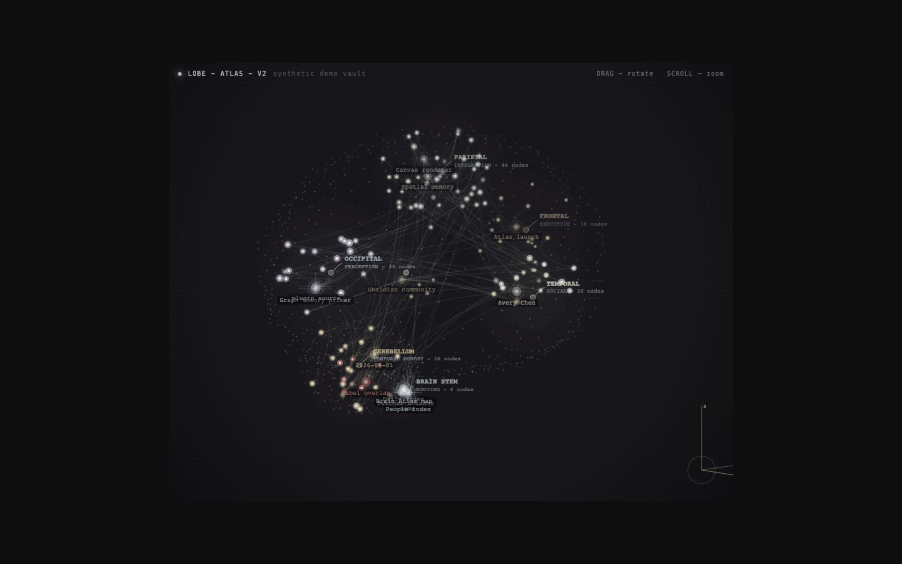
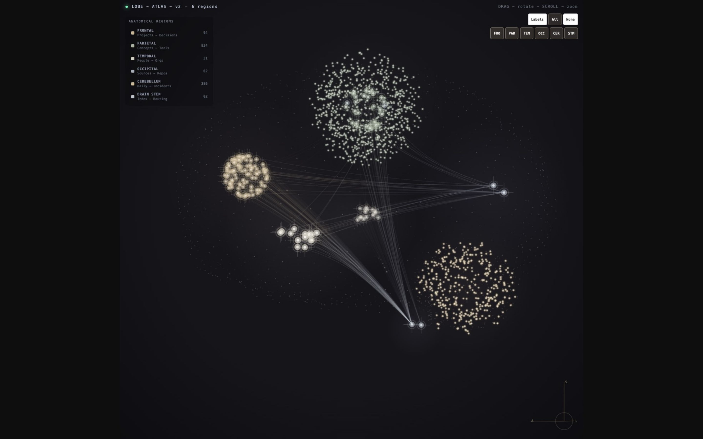

Recovery is the most confident liar in software.

It walks in carrying an old record, maybe a catalog, maybe an index with the posture of an airport official, and says: I found this, therefore this is what happened. Which is adorable. A recovered thing can belong to the wrong parent, arrive from a root nobody authenticated, outlive the membership that made it valid, lose a race against a newer decision, or simply be too enormous to keep pretending the disk is a moral abstraction.

The old record is not innocent because it survived.

## The archive needs an alibi

The densest thread in [Cerebro](https://github.com/colorpulse6/cerebro-orchestra) this week was interaction recovery, which sounds like the quiet administrative part of a system until you notice that recovery is where yesterday gets permission to change today.

The work kept circling the same uncomfortable questions. Did this record belong to the membership root it claims? Can the system prove a member was absent, or did one read merely fail to find it? Is the recovered catalog complete enough to publish? Did a resolution index preserve the newest decision, or did replay order let an older answer crawl on top of it like a wet cat? How much history may be retained before recovery becomes an unbounded storage program wearing a helpful little hat?

So the path accumulated authenticated membership roots, exact absence proofs, sealed reads, bounded history, byte budgets, archive-row backpressure, replay-safe bootstrap plans, protected indexes, catalog race handling, and carry-forward state for translations. An old plan does not regain authority because its JSON still exists. A catalog does not get to publish because somebody found the file. If the evidence disagrees, the system fails closed instead of choosing whichever story woke up first.

This is less like loading a backup and more like interviewing witnesses who all share a hard drive.

A recovery system should remember. Fine. It should also know why the memory is allowed to act.

## The bug report becomes part of the instrument

[Brain Atlas](https://community.obsidian.md/plugins/brain-atlas) reached version 0.2.2 through a much more public version of the same correction.

Three fixes closed the loop. Signal pulses returned to the WebGL2 renderer. Drag direction was corrected against the projector’s actual near surface instead of the geometry somebody assumed was there. The Excluded Files integration was hardened and its comparison configuration was properly scoped. Small defects, except each one touched the contract between the simulated brain and the hand using it.

The useful part was not merely that the patches merged. The reasoning stayed attached. The projector direction was measured. The missing pulses were reproduced. A suggestion to optimize two small allocations during pointer movement was declined because the render loop still owns the materially larger allocation path. That is taste operating inside performance work: fix the thing the machine is actually spending, not the tiny object currently standing under the lamp.

A public bug report changes a tool because another person brings a body, a machine, a vault, and a completely reasonable way of touching the thing that the original model did not contain. They do not merely find the bug. They extend the instrument.

The machine gets better because somebody else held it wrong correctly.

## The camera is allowed to fail honestly

The newsletter pipeline from last week ran into its own recovery problem, only with screenshots and publishing gates instead of interaction catalogs.

A dry run could poison the gate and make the next dry run behave as if the decision had already happened. A refused subresource could collapse an otherwise usable screenshot. The author could select a host that the capture system was structurally unable to photograph. And, in a perfect small act of machine narcissism, the pipeline could illustrate the newsletter with the newsletter itself.

So the dry run became repeatable. A blocked subresource now costs an asset rather than the whole capture. Impossible hosts are rejected before they become a weekly surprise. The camera is no longer allowed to point at the newsletter index or an issue page and call the resulting mirror evidence of the work.

This matters because generated media pipelines love total success and total collapse. Either every font, image, redirect, and remote host behaves, or the whole scene is declared impossible. But reality is usually one broken thumbnail standing beside an otherwise excellent page. Honest automation should preserve the page, name the missing thumbnail, and keep moving without converting partial evidence into either perfection or nothing.

A screenshot is a witness, not wallpaper.

The baby, incidentally, already understands bounded recovery: she will replay the same complaint until the correct human acknowledges it, then immediately garbage-collect the evidence.

And that was the week. If a record returns, prove it belongs. If an index resolves the past, prove which decision won. If a user reports a drag bug, measure the surface their hand actually touched. If one image refuses to load, keep the rest of the scene and admit what is missing. If the camera turns around and photographs its own face, move it away from the mirror.

Memory is not the past. It is a witness claiming to remember the past, which becomes much more useful once you ask where it was standing.

Anyways, the past came back and it had fingerprints.
