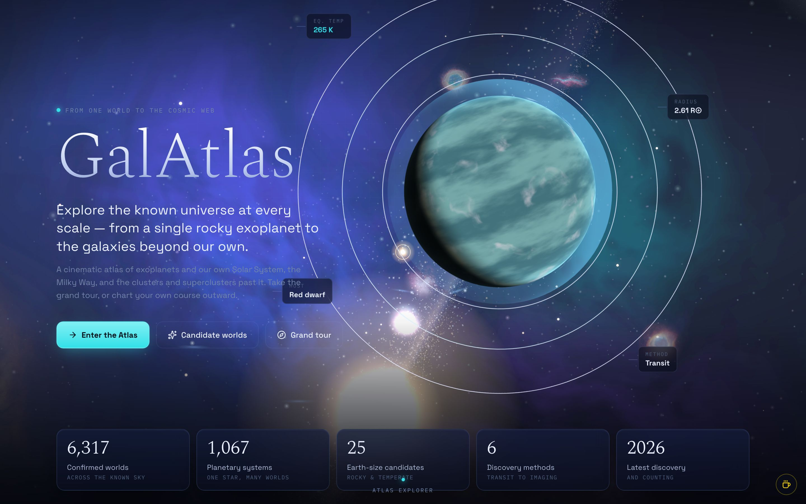
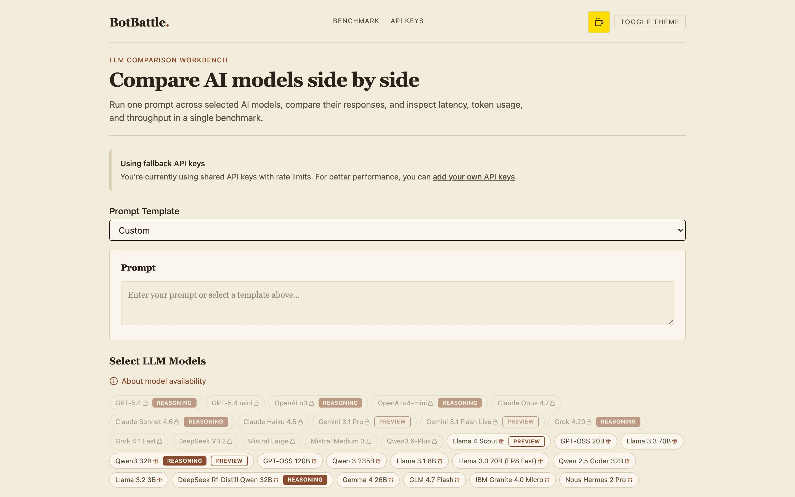

I spent the week teaching my homepage to fall into a black hole, and most of that time went into making sure it could fail to fall correctly.

Which sounds backwards until you have met a GPU.

## The collapse is choreography

The portfolio put up a forty-five commit week, most of it pointed at one idea: the homepage joins a shared cosmic canvas, the project atlas renders as real WebGL topology inside a cinematic visual system that now owns its own postprocessing lifecycle, and the landing page collapses into an event horizon. This is either a metaphor for attention or for my calendar. I have not decided.

But read the log closely and the spectacle is the minority shareholder. For nearly every commit that makes the universe prettier there is one that makes it survivable: route readiness gates frozen so a page cannot claim a scene it does not have, fallback settle preserved when the renderer fails, recovery isolated from the cinematic layer so one dying system cannot drag the other down the stairs with it, modal input fenced off from the WebGL scene, cosmic resources preserved across reset, renderer readiness invalidated on failure instead of extended on rumor.

Because a cinematic surface is a promise, and the browser reserves the right to decline it on a five-year-old phone with nine tabs open and a battery percentage best described as spiritual. The work is not the black hole. The work is deciding in advance what the page does when the black hole refuses to open.

None of it is live yet. It is falling on a branch, which is the correct venue for rehearsing a collapse.

## Sign it where the readers actually read

The quieter sweep went the other direction, outward, across everything already deployed. [GalAtlas](https://galatlas.com/), [Regexplain](https://www.regexplain.cc/), [BotBattle](https://www.botbattle.cc/), [Polis Atlas](https://polisatlas.com/), and [Sector Zero](https://colorpulse6.github.io/sector-zero/) all received the same shared maker's mark this week, plus structured data attributing each surface to one canonical author entity. The portfolio itself now wears the mark in its header, shrunk to a 192 pixel file, because performance is also a form of manners.

A signature used to be for people. You made the thing, you put your name in the corner, a human squinted at it in a gallery. But the entities doing most of the reading now are crawlers and language models, and they do not squint, they parse. If a site cannot state who made it in a format a machine respects, then as far as the machine consensus is concerned the work built itself. And the work did not build itself. I checked. I was there.

So one identity went onto all of it, the serious atlases and the toys alike, like a tiny federal seal.

Attribution is not vanity. It is infrastructure that happens to have my name on it.

## Receipts or it did not run

Meanwhile the automation layer spent the week being asked a rude question: not whether it was running, but whether it had produced anything.

The marketing producer had just finished the best month of its life on paper. Every scheduled job green, every log clean, and the runner script had quietly become a shim that exited zero and did nothing at all. A month of reassuring status, zero artifacts. So the dead jobs were uninstalled and the weekly producer reinstalled on a real schedule, at which point the restored runner refused its first cycle because its liveness check had discovered a process that looked suspiciously like itself. It was itself. It now takes a per-brand lock like a normal citizen.

The newsletter machine got the same audit and turned out to be failing behind a macOS permission wall, silently, every week. The fix was humiliatingly physical: run the scheduled jobs through an executable the operating system actually trusts, and let a draft heal its images after a failed capture instead of treating one lost screenshot as a house fire.

And in the spirit of receipts: this issue is late. On Friday the pipeline collected the week, built the packet, handed it to the author model, and the author model discovered it had no internet. It tried five times. It died. The gate recorded a failed draft, and on Sunday the publish job, doing exactly what it was designed to do, archived the silence. Silence is not approval. It is also, it turns out, not a newsletter.

A green light is a claim. An artifact is proof. Everything else is a process wearing a nice shirt.

## The immaculate queue

The corollary sat in the daily notes all week: ten social assets rendered and approved, four fresh recipes per brand, five political drafts prepared every morning, and almost none of it published. Production is solved. Distribution is the bottleneck, and a queue that never ships is just inventory with good lighting. The machines can make things all day now. Choosing to be seen is still a human job, apparently by design.

I am back at the day job now, so all of this happens in the margins, before dawn and around the noon Spanish ritual, while the baby files her incident reports with sub-second latency and total conviction.

And that was the week. Rehearse the fall before you perform it. Sign the work where the readers actually read. Keep the receipts, especially from the machines that smile.

Anyways, the homepage is falling beautifully. We practiced.
