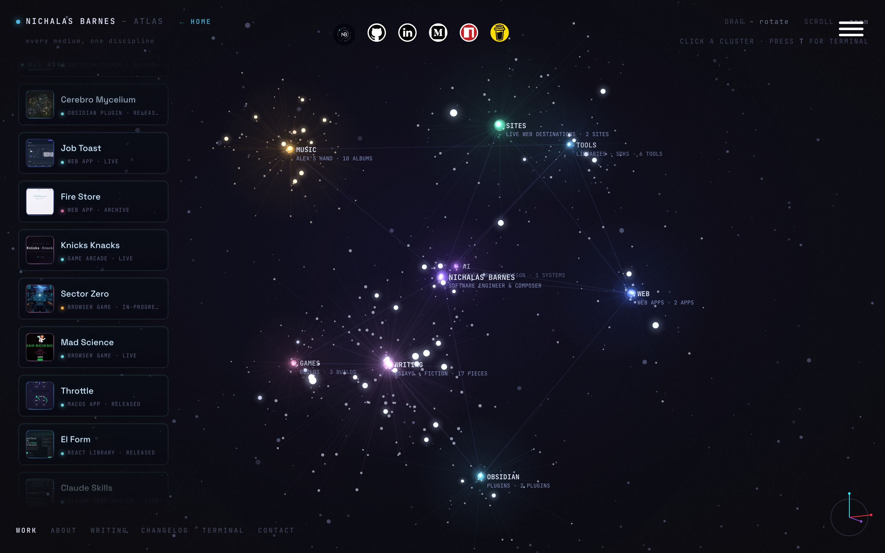
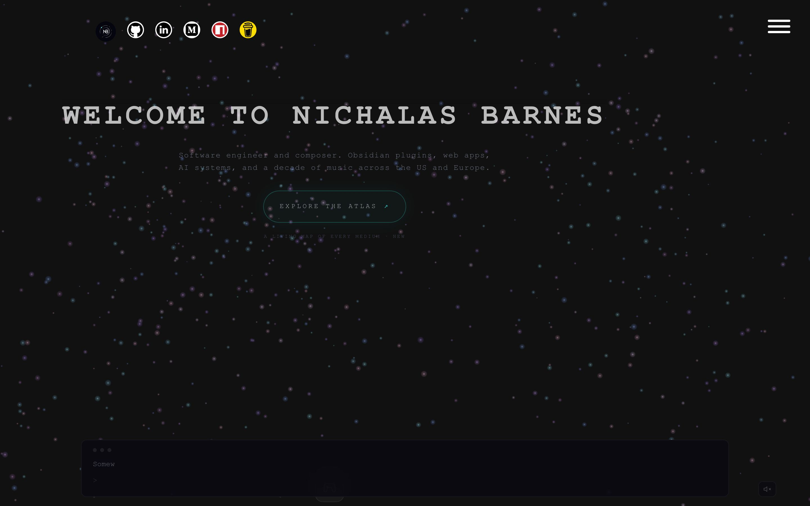

A system is allowed to be quiet. It is not allowed to make quiet mean five different things.

Quiet can mean loading, waiting, sleeping, finished, broken, waiting for you, waiting for God, or waiting for a browser tab to receive the small mercy of death. Internally these are different countries with different currencies and extradition laws. From the outside they are all a spinner.

This week was mostly about making the machinery betray itself.

## The universe arrives while you are looking

Last week the homepage was rehearsing its collapse. I had a black hole on a branch and a long list of ways it might decline to be a black hole, which is the correct relationship to have with anything involving a GPU.

This week the collapse grew a destination. The portfolio’s [Atlas](https://nichalasbarnes.com/atlas/) became the default cinematic surface, the camera gained a continuous journey through the wormhole, the wormhole gained a synchronized soundscape, the galaxy got its colored clusters back, and the hover field learned to ignite and breathe. The tube became real. This is technical language.

But the commits I like are still the ones standing behind the spectacle with a wrench. Every journey lane was bridged. Wormhole resources were sealed. The soundscape fades from its actual audible level instead of some imaginary volume it remembers from childhood. Deferred ambient gain now follows the mute toggle, because silence chosen by the user should remain silence even when another system wakes up late and feels musical.

A cinematic transition is not merely an animation between two pages. It is a temporary world with an entrance, an exit, gravity, sound, memory, and several opportunities to strand a person inside a glowing tube forever. Once the camera begins moving, every subsystem has to agree about where arrival is.

The galaxy can look chaotic. The handoff cannot.

## The machine should sweat in public

The most important sentence in [Cerebro](https://github.com/colorpulse6/cerebro-orchestra) this week may have been the least glamorous: publish live executor rows incrementally.

An agent can be doing real work for six minutes while the interface looks like a dead refrigerator. Files are opening, tools are running, decisions are being made, failures are being classified, and the person watching receives one magnificent piece of information: not done yet. The internal truth is moving while the visible truth has been taxidermied.

So the interaction layer started exposing the work while it happens. Executor rows publish incrementally. Reconciliation drains in bounded pages. A continuous selectable transcript prototype tests what it feels like when the terminal is treated as an actual working surface instead of a decorative window where text goes to become gray. Legacy runs are allowed to terminalize rather than bricking startup, scheduling failures stay out of the run pipeline, and worker failures receive classifications the interface can report.

This is observability, technically, but that word makes it sound like a dashboard assembled by twelve rectangles. What I want is simpler. If the machine is working, let me see where its hands are. If it failed, tell me what kind of failure. If it finished, leave the body.

Progress is not reassurance. It is evidence arriving before the verdict.

## Silence gets paperwork

Last week I wrote that silence is not approval. This week I added publish-on-silence to the newsletter pipeline, which looks like a contradiction because it is one, sort of.

The old pipeline could produce a draft, lose the author to a network failure, arrive on Sunday with nothing, and faithfully archive the nothing because no human had approved it. Perfect obedience. No newsletter.

The new contract gives silence a veto window. If nobody vetoes before the window closes, publication can proceed, and if the Sunday draft has gone missing the pipeline can heal the missing artifact instead of building a small administrative shrine around the absence.

Silence is still not approval in a conversation. But silence can become a valid input when a system names who may object, how long they have, what happens when the clock expires, and how the missing thing is recovered. The difference is not philosophical. It is paperwork.

A default is a tiny constitution. It decides what happens when everybody is busy, asleep, holding a baby, or staring at a terminal that has forgotten to sweat.

The baby, incidentally, has no ambiguous loading state. If something is wrong, the entire house receives an event.

That may be the standard. Let the universe breathe, let the work leave footprints, let the silence expire. If nothing else, make the state audible from the kitchen.
