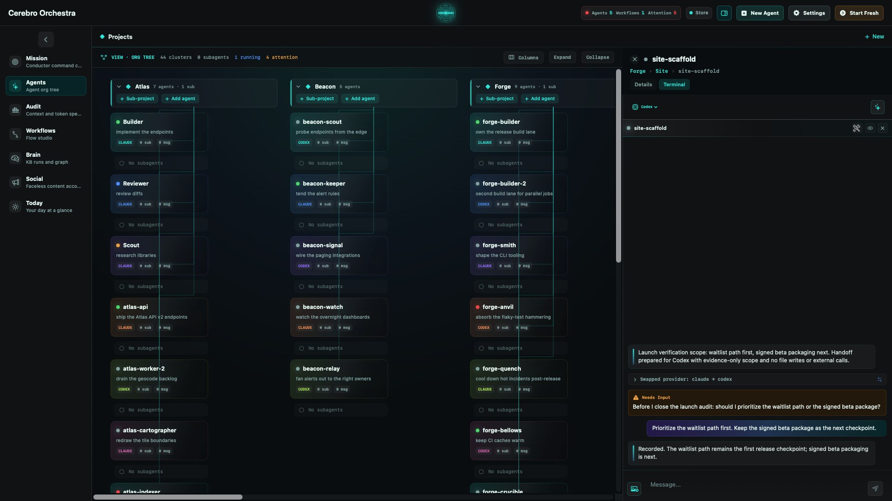
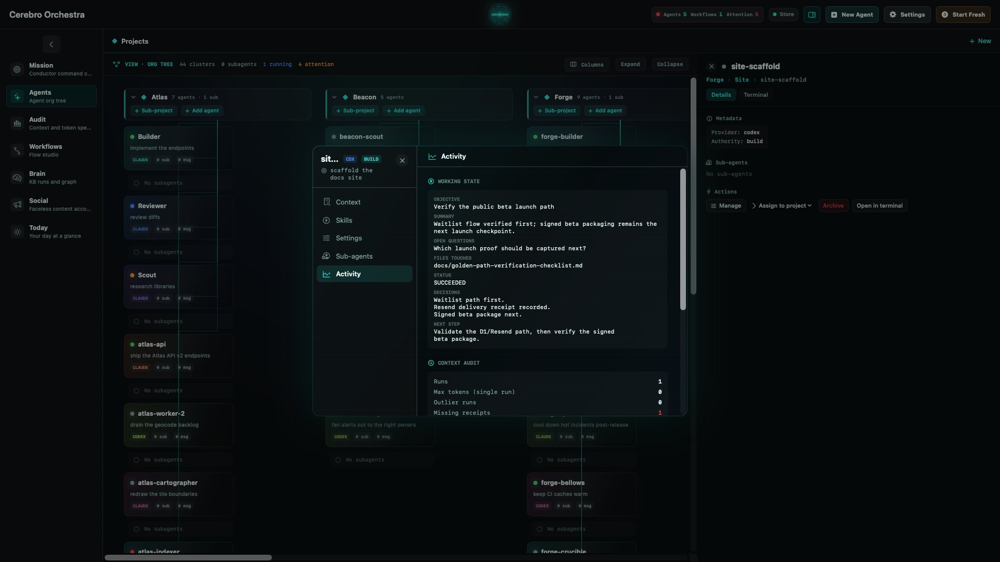

A question should exist before its answer does.

This is one of those statements that feels too stupid to require engineering, like doors should open or soup should remain mostly inside the bowl, and then a computer gets involved and suddenly causality has an implementation ticket.

Last week I got the machine to show its hands while it worked. This week I discovered it could still forget who asked it to work.

## The question goes first

In one path through [Cerebro](https://trycerebro.com/), a sent message did not enter the visible transcript until the provider had something to say back. If the model thought for forty seconds, the interface held your question somewhere behind the curtain, showed you nothing, and then allowed the answer to arrive carrying its own cause like luggage.

The conversation eventually looked correct. Chronologically, it was nonsense.

So the terminal now echoes a sent message before the provider answers. Immediately. Your question becomes part of the record at the moment you ask it, whether the agent responds, stalls, swaps providers, hits a tool failure, or wanders into the forest to become a different kind of software entirely.

This is usually called optimistic UI, but optimism is not really the point. The interface is not guessing that something succeeded. It is acknowledging that you did something.

The message was sent. Put the body on the floor.

## One document, not conversational debris

The larger terminal pass followed the same rule. A transcript is not a stack of decorative bubbles that happen to be standing near each other, it is a document, a sequence of claims and actions whose order matters because the order is how you reconstruct what the hell happened.

The new surface renders one continuous selectable transcript. Live cards sit inside that document instead of interrupting it from a parallel universe. Awkward code-fence inputs got pinned in tests. The shared surface was mounted in every agent placement, and the hand-built harness gained live-tail replacement so the last moving piece of output can update without rebuilding the entire past around it.

That sounds like text-selection work, and it is, but selecting text is one of those tiny freedoms that reveals whether an interface respects its own contents. Can I drag from my question through the explanation and into the tool result? Can I copy the strange middle where the agent changed its mind? Can I read a run as one event, or must I assemble it from boxes like an archaeologist reconstructing a vase from twelve React components?

The terminal is becoming less like a chat window and more like a working surface, which is what it was pretending to be all along.

## The package signs its name

Then the release build started crashing on every agent dispatch.

There is something wonderfully clarifying about polishing the transcript, declaring the surfaces, recording the evidence, and then watching the packaged application fall over the moment an agent tries to do its only recognizable job. A development build can flatter you. Packaging is when the software meets the version of itself that has to leave the house.

The dispatch crash was fixed across the release path. Task-local guards were moved onto a declared surface, two pinned behaviors were frozen again, terminal smoke blockers were closed, Dev evidence was recorded and re-attested, and the residual ledger had its dangling references repaired. Then the packaged build stamp was changed so it describes the features actually inside the package instead of whatever the branch, build script, or surrounding ceremony hoped might be there.

A build stamp sounds administrative until it lies.

If a package says a surface exists, that statement should be earned by the artifact in hand. Not by code on another branch, not by a passing test against a development configuration, not by a ledger entry inherited from Tuesday. The binary either contains the feature or it does not. The stamp is testimony.

Nothing received a public release this week. That matters too. The work reached recorded Dev evidence and an honestly stamped package, which is not the same thing as a person installing it, exercising the path, and watching it survive. The ladder remains a ladder even when you are tired of climbing it.

Most interface work asks what should happen next. This week asked what must be left behind: the prompt before the answer, the tools inside the reading order, the crash fixed before the release claim, the package describing the object it actually contains.

Machines are fast enough to make sequence feel old-fashioned. It isn’t. Sequence is how responsibility survives the speed.

The question arrived first. Now the build remembers it.
