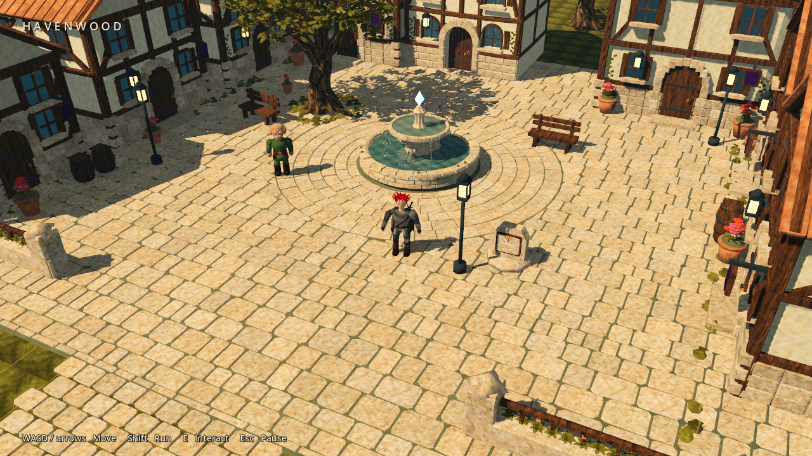

An error message is a room the software has locked you inside.

It can be exquisitely specific. It can name the provider, the environment, the preflight, the thing that failed before the other thing could begin, seventeen nouns standing in a red line like a brass plaque outside a government office, and still leave you there with no door.

Machines have this strange instinct to treat explanation as recovery. Here is what went wrong, they say. Anyways, good luck living here.

This week I started adding handles. Sunday morning found several more rooms, and a few new worlds outside them.

## Bring your tools to breakfast

In [Cerebro](https://trycerebro.com/), a managed-provider setup failure now lands inside the Conductor transcript with a Retry action beside it. The cause appears where the work stopped. The next move lives next to the cause.

Then an audit found that an agent could arrive with my tools, skills, and instructions, and lose them because it had been connected to Cerebro's own tools. Isolation intended for a managed environment had spread into the path meant to inherit my existing setup. We had invited the carpenter inside and confiscated the toolbox.

The correction is in local main. Inherited agents keep the user's configuration, and project instructions sit beside native instructions. Claude's live check passed; Codex's remains open.

This morning the Today view also learned to gather scheduled jobs from several systems and place them beside the daily Brain note. That work is merged locally, covered by 1,320 focused tests, and verified in the development app. A follow-on branch is turning the pile into one daily brief with working note links, while preserving reminders and risks verbatim.

That last part is still branch work. A dashboard can collect every fact and still fail to answer the only morning question that matters: what deserves my attention?

## Repair earns the next feature

[Job Toast](https://jobtoast.io/) began the weekend with three retired AI model identifiers, an unavailable fallback chain, background work consuming the user's interactive allowance, confused billing paths, and too many worker processes for the small instance holding them.

Those repairs merged first. Then the product work could begin.

Today Job Toast gained interview preparation inside each job. Generated questions are available to free users; AI-drafted answers belong to Pro and remain editable before saving. The free cover-letter allowance moved from a generous-looking daily number to ten per calendar month, while paid model usage gained a monthly spending ceiling and a free-provider fallback when that budget is reached.

This is pricing work expressed as software. A paid tier should contain an actual advantage. A free tier should have a limit a person can understand. A product using paid models should know how much enthusiasm it can afford.

Both feature sets are merged to main. Production journeys remain a separate proof from the merge.

## Evidence should survive the trip

Elsewhere in my work, I spent time with a quieter problem: a fact can survive being copied while the evidence for it disappears.

The receiving system gets the value. It does not necessarily get the reason it should trust the value. After a few moves, something inferred can look exactly like something verified.

The useful distinction was between preserving historical context and granting it authority. An incomplete old record can remain useful history without being promoted into proof. The repair keeps that distinction through the handoff and requires the receiving side to verify the evidence behind the stronger claim.

There is a temptation to fill the gap because the answer looks plausible and uncertainty is making the row untidy. But tidy uncertainty is still uncertainty. I would rather keep the missing piece visible than manufacture a more confident past.

## A world has to become a place

[Sector Zero](https://colorpulse6.github.io/sector-zero/) crossed one threshold by merging a cinematic opening and companion-site redesign upstream. The game now has a front door that explains the choice between its persistent galaxy and legacy campaign, followed by a visual tour of the ways you can fight and the settlements between them.

Its next graphics branch is pushing deeper into first-person world detail and actor motion. That work follows the touch controls, focus fixes, and mission presentation built earlier in the week. A galaxy is partly lore and partly the unglamorous ownership of a key press.

Chimera made a different leap. A design that had lived mostly as a lineage of ideas became a packaged native 3D level: a town square, characters, an interior, dialogue choices, a small anomaly, and a local save. The first pass reached a verified playable route. Then the work split into actual rendered comparisons for richer materials, new architectural geometry, and a more illustrated treatment.

The comparison is useful because it refused to flatter the new thing. The candidate keeps the navigation and gameplay contracts and passed 125 checks, but the median frame time in the measured route rose from roughly seven to twelve milliseconds, and its 95th percentile still missed a consistent 60 FPS frame budget. The scene also does not yet reach the density of the target illustration.

Playable is a threshold. Beautiful is another one. Measured is how you avoid confusing the two.

## The calendar is not a witness

The Marketing work spent the day closing the loop between making content and learning from it.

A read-only Instagram collector is now installed and has completed a live run across both brands. It keeps zero separate from missing data, compares posts at similar ages, and remains exploratory when the sample is too small. Three new Reel formats were rendered and inspected as previews, without sneaking them into a live queue.

The YouTube half is built but not fully connected. Basic channel data is reachable; Analytics still returns an access error. The planner therefore has machinery for watch time, retention, and subscriber evidence, but it cannot claim those observations yet.

This is the same lesson as the scheduled job that arrives punctually every morning and fails immediately. A calendar proves that time passed. It does not prove that work happened, that somebody learned, or that the next decision became better.

I keep coming back to what happens immediately after the software says something. Error. Saved. Sent. Ready.

Can I recover? What did it preserve? Did somebody else already do this? Ready for whom?

An error can be beautifully described and completely uninhabitable. The interesting work is putting something beside the description: a retry, a surviving tool, a reason to trust the record, a budget, a playable street, a measurement that is allowed to say not yet.

The error grew a handle.

You can leave now.
