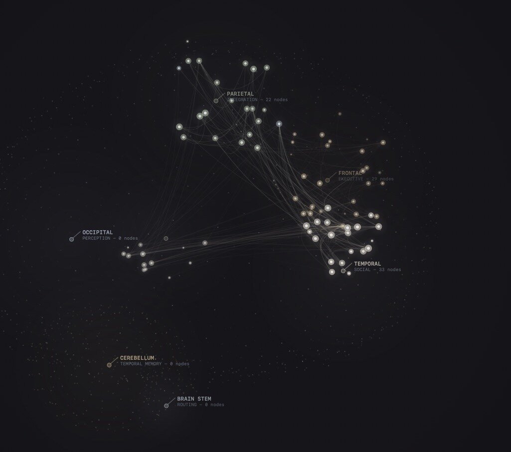

I like connecting things. This is probably how I end up maintaining so many things that need connecting.

You have a notebook, an assistant, a button that introduces them, and for a moment the arrangement seems complete. The notebook contains your thoughts. The assistant would like some thoughts. We have put them beside each other. Surely the difficult part is over.

Then the assistant says it cannot find anything, and you begin inspecting the considerable distance hidden inside the word connected.

[Cerebro](https://trycerebro.com/) gave me several versions of this distance this week. Its Conductor could lose access to the Brain because reading the notebook depended on an unrelated plugin being active. Another path started fresh provider conversations while telling them to reuse context from an earlier conversation they had never received. Imagine meeting somebody for the first time and opening with, anyways, as you already know.

The repairs remove that unrelated dependency and send the full application context on the affected turns. But they also exposed a more ordinary problem: the local app had no notebook configured. The assistant was trying to explain an elaborate failure of communication before establishing whether anyone had plugged in the telephone.

So the Brain now gets an explicit status in the Conductor’s context, including when it is disconnected and where to connect it. There is also a connection flow that builds the indexes the app needs from a folder of notes, keeping those generated files in the app’s own storage. If the notebook already supplies its own compiled index, that one takes precedence.

That choice matters to me. Connecting an existing collection of thoughts should not require turning the collection into somebody else’s preferred filing cabinet.

The connection work is merged into local main, with focused tests for index creation, refresh after a note changes, and leaving settings untouched when the feature is disabled. The retained local-use record includes a successful connection and a working Brain. The release card remains at local testing, and the broader test run still records an unrelated packaging failure. There is a usable thing here. Public release is still another step.

While that work was coming together, a much smaller change nearly made old records unreadable.

Cerebro gained a new permission flag. Old records did not contain it; the new code understood its absence as false. Sensible enough. But when the code wrote those records back out, it helpfully included the new field with its false value.

The archive checks its integrity by decoding records, encoding them again, and comparing the result with the stored digest. The meaning had survived. The encoded representation had changed. Every affected old archive could therefore look damaged to the new reader.

I find this kind of mistake almost reassuring in its specificity. Nothing mysterious happened. We added one apparently harmless fact, and the machine took us literally.

The correction writes the flag only when it is true, preserving the old representation when it is false. A regression test checks both cases. The existing archive fixture was doing its job when it complained; updating the fixture to make the complaint disappear would have removed the warning and kept the problem.

Sometimes the old test is the only person in the room who remembers what we promised.

[Job Toast](https://jobtoast.io/) had a different disagreement between two parts of the same product. A job saved through the browser extension could arrive safely without entering the match-scoring queue.

The server had grouped integration-token callers together and skipped several expensive follow-up operations for them. That boundary had a reason to exist. But the extension also arrived through that boundary, carrying permission to use AI, and the broad classification swallowed the more specific permission.

The correction on the current branch checks that permission when deciding whether to queue match scoring. Ordinary signed-in saves retain their existing behavior, integration tokens without AI access remain excluded, and a scoring-queue failure does not turn an already saved job into a failed save.

That last distinction is easy to lose while making the product more helpful. You asked it to keep something. It should keep it, even if its additional opinion about the thing is temporarily unavailable.

The branch includes regression cases for those permission boundaries and the queue-failure path. I have not established a merge or a production run for this correction. The useful progress is that the missing score now has a concrete cause, a bounded change, and tests aimed at the place where the two parts disagreed.

My marketing tools encountered a less philosophical boundary: a video’s audio bitrate.

The publishing adapter had parked an item before upload. Repairing the audio file was only half the recovery, because the publishing records still correctly remembered an item that should not proceed. Last week I wrote about counting what remained in the queue. This was about letting one particular item return without giving the whole queue amnesia.

The new recovery script probes the repaired file, checks that the recorded failure concerns audio bitrate, and refuses automatic release if it finds evidence of an upload session or an already published post. It retains the original failure inside the recovery record and assigns another scheduled slot. The script is on main; the evidence I inspected does not establish a completed retry.

I like that the failure gets to remain in the story. We do not have to pretend the first attempt was fine in order to permit another one.

And perhaps that is why I keep connecting these things, despite the expanding collection of cables under the desk. There is a particular pleasure in reaching for a note and finding it, saving a job and being allowed to move on, watching an old record survive a new idea about how the software should work.

For a moment, you can stop thinking about the connection.

You have your thought back.
