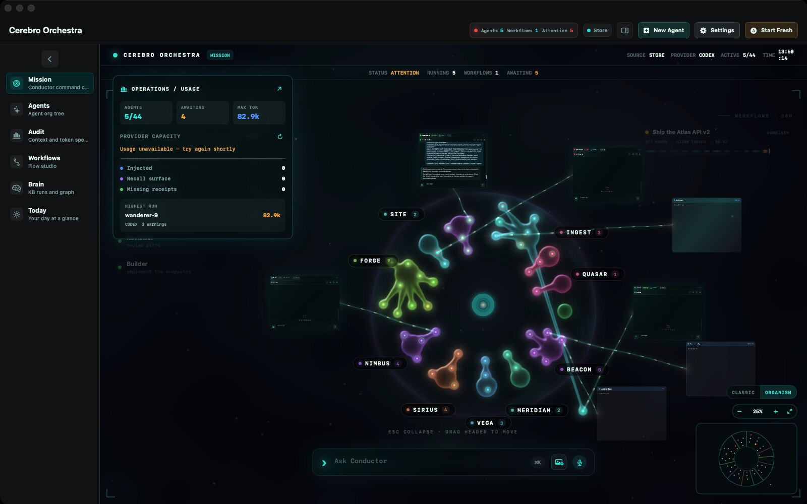
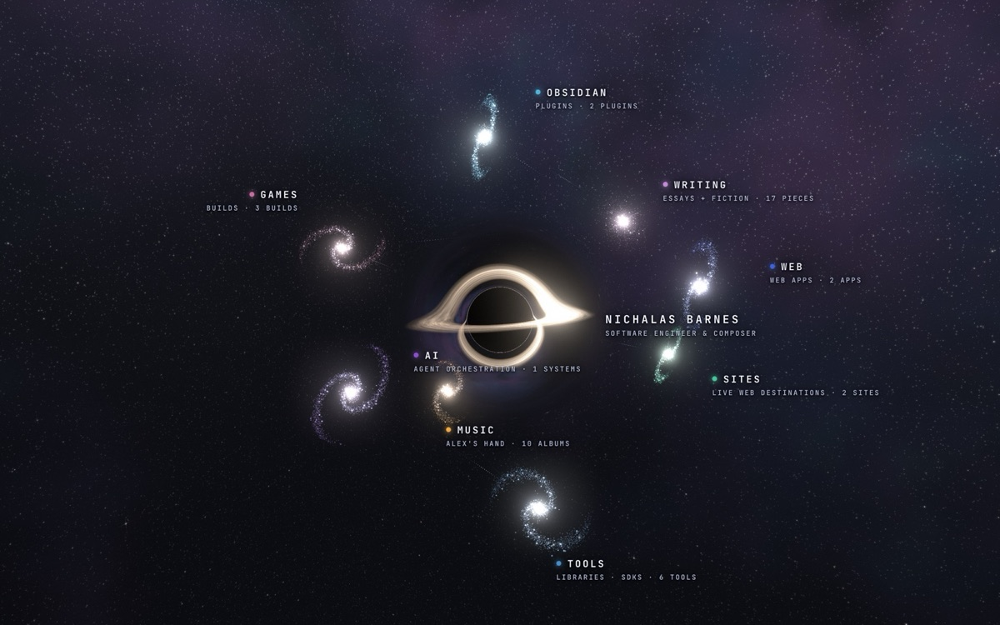

Apparently I wanted a black hole on my website.

There are simpler ways to organize a portfolio. A list, for example. Lists have an excellent record of containing things, and almost none of them require you to consider what happens to keyboard focus during interstellar travel. But I had projects, music, writing, a growing collection of things I wanted to put beside each other, and somewhere in the process beside became orbiting.

I can defend some of this as navigation. The rest is because I wanted to see it.

The week also supplied a useful counterweight: before you bend a page into space, it helps if an ordinary page can finish signing somebody in.

[Job Toast](https://jobtoast.io/) had a database connection problem that reached the browser extension as an apparently broken login. The website could have a session while the request that lets the extension pick it up failed. From the outside, these are two parts of one action. You signed in. Why are you being asked to sign in?

Underneath, several database clients were making individually reasonable assumptions about how much room they could occupy. Each pool had its own default allowance, while the database had one allowance for the entire application. Nobody was adding up the chairs.

And then there was the middleware order. Static files passed through session handling, so requests for the page's assets could also read the session row. The browser was trying to assemble a screen and, along the way, repeatedly asking the database who you were.

The repair gives the different pools explicit, smaller budgets and serves static files before session handling. Background workers get a smaller pool allowance too. These changes are merged to main. The inspected evidence establishes the correction in code, without establishing a fresh production login journey after it.

I like the specificity of this one. The symptom suggested an identity problem, but part of the answer was to stop asking an identity question where none was needed. A stylesheet has very little interest in your personal history.

[Cerebro](https://trycerebro.com/) crossed a larger threshold: the public Mac beta was released this week. Version 0.1.0 is signed and notarized, for Apple silicon Macs running macOS 14 or newer, using the provider command-line tools you already have installed.

After several issues of describing local work and the distance still left to release, it is nice to be able to write that sentence.

The release work also found a small disagreement with considerable practical consequences. The release interface could say a draft was valid and offer to build it, while the builder's own checks would reject it. Feature evidence could be stale. A saved draft could still carry a build number that had already been used.

So you could receive permission from the button to begin an operation the next layer already knew it could not perform. A tiny bureaucracy, installed entirely on your own computer.

The correction makes readiness use the builder's actual checks, including whether the proposed manifest can be committed. A stale saved draft advances beyond existing build numbers, and the checks run again when Build is clicked. That second check matters because the world is allowed to change while a window remains open.

Later candidate work exposed another boundary: a launched process could finish after its caller had dropped the object responsible for collecting its output. If process exit won the race against the output callback, the final text and completion event could disappear.

The fix keeps that object alive through completion, then releases the relationship once cleanup is done. The regression case deliberately discards the returned handle and still expects the child's final words and successful exit. Those later repairs are on local main; their presence there does not establish that they are in the downloadable beta.

I find myself increasingly interested in these last few inches of an operation. The work ran. Did its result reach anyone? Who remains responsible after the person who started it has wandered off?

Anyways, back to the black hole.

The new [Atlas](/atlas/) arranges the site's projects, albums, and writing into a galaxy map. The home page reaches it through a wormhole, with a synthesized score and a view that opens onto the surrounding collections. The change is merged, and this week's changelog records it as live.

The part I particularly enjoyed was getting the departure to belong to the page you were actually looking at. The transition takes a rendered snapshot of the live home page, including its current geometry, text wrapping, images, and particle frame, then bends that image into the journey. If the substitute page differs at the moment of departure, you see the swap. The illusion gets caught changing clothes.

That meant paying attention to ordinary layout details inside an unreasonable visual idea.

It also meant giving the journey a tolerable relationship with interruption. Leaving early stops the music. A rendering failure has a route through to the Atlas. Browsers without WebGL2 get the classic view. The browser harness includes checks for skipping, arrival focus, and graphics-context loss; the timeline tests look for jumps where one phase becomes another.

And the names are clickable. After all that effort putting something in space, you should be able to open it by clicking the words that tell you what it is.

There is still a list underneath my galaxy. I think that is part of why I like it. You can follow the light around the black hole, find something you didn't know was there, spend a moment looking. Or you can know exactly what you came for and open it.

I wanted the little journey. You might just want the project.

The title works too.
