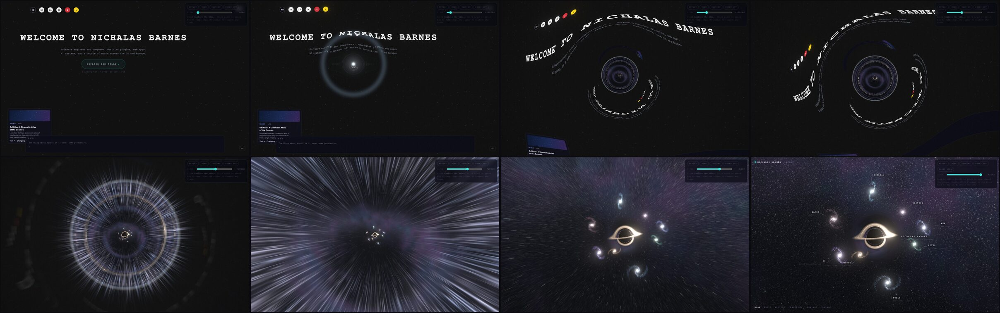
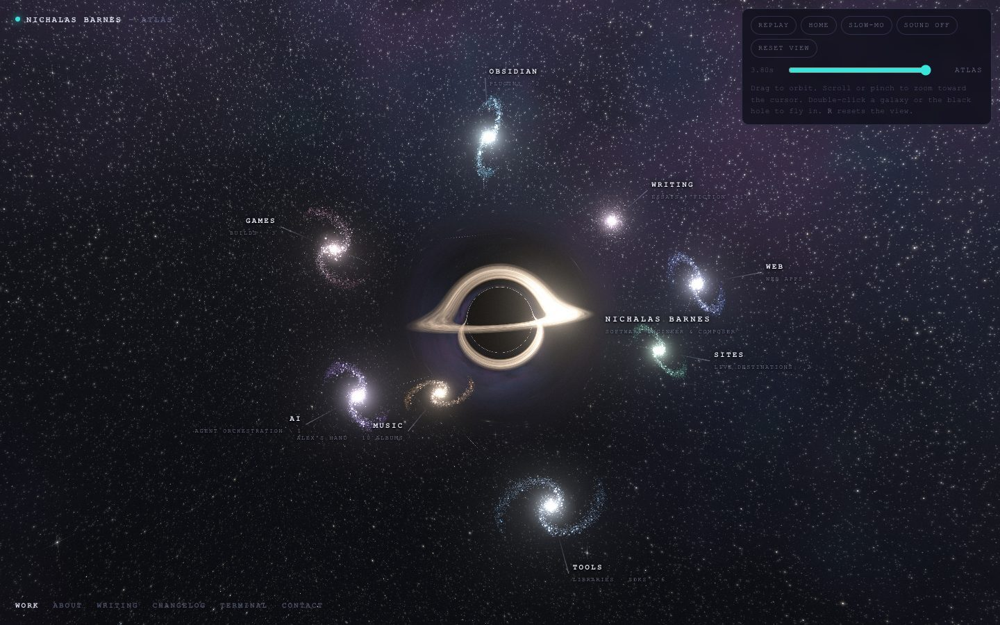
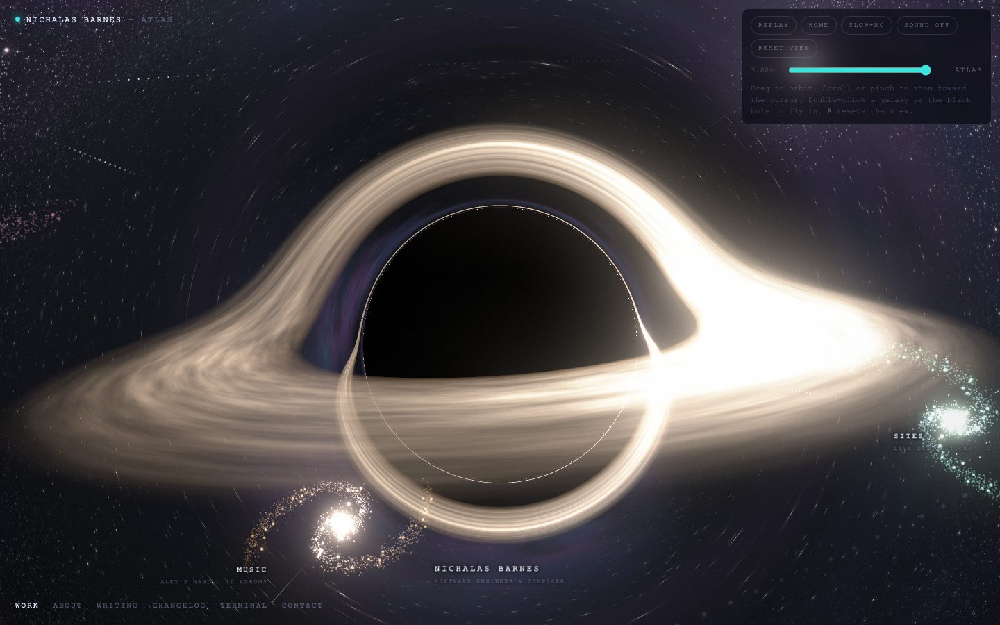

# Cosmos Atlas and Wormhole Journey

Status: design approved in brainstorming; written spec reviewed once (4 issues fixed), awaiting Nic's review

Date: 2026-09-26

Branch: `feat/cosmos-atlas` (worktree `.worktrees/cosmos-atlas`)

## Summary

Replace the home-to-Atlas "hyperspace dive" (a 2D starfield streak plus a flat
flash) and the Canvas2D Atlas with one continuous WebGL experience:

1. **The journey.** Clicking "Explore the Atlas" opens a physically lensed
   wormhole at the button. The real home page bends around it, the visitor
   falls through a glowing throat, and exits beside a ray-traced black hole.
2. **The Atlas.** A WebGL galaxy map: a Gargantua-style black hole at the
   center (Nichalas Barnes) and eight domain galaxies. It supports zoom, pinch,
   orbit, fly-to and cluster entry, with every existing panel and control kept.

Everything ships in one launch. Milestones are internal checkpoints on the
feature branch, not separate deploys.

## Visual reference (canonical)

The approved prototype is the visual and numeric source of truth. When this
spec and the prototype disagree on a look or a constant, the prototype wins
unless this spec states a deliberate change.

- Live prototype: https://claude.ai/artifact/1yEQAtWncQSXStPoA7EfWT
- Prototype source (open directly in Chrome):
  [`assets/2026-09-26-wormhole-study.html`](assets/2026-09-26-wormhole-study.html)
- Storyboard, left to right, top to bottom: home, ignition ripple, lensed title,
  spiral inflow, portal with throat light, tube transit, exit, Atlas arrival.







The prototype was verified in headless Chrome on an Apple M1 Max at 2880x1800:
journey 60fps, Atlas 60fps, black-hole close-up 60fps at 0.8 adaptive scale.

## Decisions made during brainstorming

| Topic | Decision |
|---|---|
| Transition look | Interstellar wormhole with real gravitational lensing (Ellis-type metric after James, von Tunzelmann, Franklin and Thorne, 2015) |
| Scope | Wormhole journey plus a full WebGL rebuild of the Atlas |
| Atlas core | Gargantua-style black hole with a lensed accretion disk |
| Journey length | About 3.5s first time per session, shorter on repeats, always skippable |
| Zoom | Scroll/pinch zoom toward the cursor, double-click fly-to, reset, orbit inertia |
| Entered galaxy | Projects appear as bright named stars in the galaxy disk |
| Release | Ship everything together in one launch |
| Codex branch | `codex/wormhole-atlas-design` stays untouched; ideas may be borrowed, code is not merged |

## Goals

1. The home CTA produces the prototype's journey on the live site, using the
   real home page as the lensed image.
2. One WebGL canvas persists from the home click into the Atlas: no route cut,
   no renderer swap, no blank frame.
3. The Atlas keeps every current content path: domains, projects, essays,
   fiction reader, changelog, about, contact, terminal, project rail, header
   and sidebar navigation.
4. Stars stay pin-sharp at any lens magnification; labels stay readable.
5. 60fps on a modern laptop at retina resolution; a usable lighter tier on
   phones; graceful fallback without WebGL2.

## Non-goals

- Changing the look of the home page before the click, or any other page.
- A reverse journey when leaving the Atlas (a plain fade is fine; revisit later).
- Rewriting panel content, the terminal, or the project data model.
- Deleting the legacy Canvas2D Atlas in this project (it becomes the
  no-WebGL2 fallback; removal is a later cleanup).
- Merging the Codex branch.

## Experience specification

### Journey timeline (first visit in a session)

Times are seconds after the click. Constants come from the prototype `J`
object and `params()` function.

| Time | Beat | What the visitor sees |
|---|---|---|
| 0.00 | Click | Input locks. The home DOM is swapped for its snapshot under the ignition flash. |
| 0.06-0.36 | Ignition | A point of light at the button; the button fades into it; a refraction ripple bends nearby text. |
| 0.10-1.15 | Opening | The wormhole sphere grows to 7.5 degrees. The title and page bend into lensed arcs with a mirrored second image. The Atlas is visible inside the sphere. The camera turns to face it. Content drifts and spirals inward. |
| 1.15-2.30 | Plunge | The sphere fills the view. Page fragments dissolve by 2.15. Throat light (streaming filaments) builds from 1.95. |
| 2.20 | Rim | The sphere edge sweeps past the screen edges with a chromatic split. |
| 2.30 | Crossing | Brief exposure lift, shake and chromatic aberration. Inside the tube, light streams past; Gargantua waits at the far end. |
| 2.30-3.20 | Exit | The Atlas unfolds; the camera dollies in with a slight overshoot. The lens effect fades to identity by 3.12. |
| 3.20 | Hand-off | The route changes to `/atlas`. The stage switches from lens mode to direct Atlas rendering with no visible change. |
| 3.20-3.80 | Resolve | Labels, header, rail, hints and bottom nav fade in. Input unlocks. |

Controls during the journey:

- Click, tap, or Esc skips to 3.20 (hand-off) and continues from there.
- Repeat journeys in the same session (sessionStorage flag) run the same
  timeline 1.45x faster.
- `prefers-reduced-motion`: no journey. The page crossfades to the Atlas in
  0.5s.

### Atlas: galaxy view

- Composition from the prototype: the black hole at the origin, domains at
  `domain.p * 8.8`, arrival camera at azimuth 0.42, elevation 0.2, distance 24,
  target (0, 0.3, 0). Portrait screens pull the camera back by 1.22.
- Eight domain galaxies (spiral; Writing elliptical), tinted by domain color,
  with the cosmic-web links from the current `EDGES` rendered as dotted light
  paths with traveling pulses.
- Deep sky: nebula cube map, three star layers with the pixel-sized PSF and
  lens-magnification brightness from the prototype.
- Labels: DOM, positioned by the engine each frame, pushed outward from the
  black hole past each galaxy's projected radius, with a leader line, a dark
  text halo, and clamping inside the safe area (clear of the header and the
  bottom nav). Sub-labels hide below 560px width.
- Input:
  - Drag orbits with inertia.
  - Scroll and pinch zoom toward the cursor.
  - Double-click empty space zooms in 1.8x toward the point.
  - The **R** key or a Reset control returns to the arrival view.
  - The **+** and **-** keys zoom.
  - Idle auto-drift resumes 4s after the last input.
- Hover a galaxy: the cursor becomes a pointer, the galaxy brightens slightly,
  and its label emphasizes.
- Click a galaxy: enter it (below).
- Click the black hole: open the About panel. Double-click it: fly to the
  close-up.
- Zoom limits: 0.12x to 2.6x of the arrival distance. The camera never comes
  closer than 4.75 units to the black hole center.

### Atlas: entered galaxy

- The camera flies to the galaxy (orbit target = galaxy center, distance 0.3x)
  over about 0.9s. Other galaxies, the web and their labels dim to 25%.
- Each project is a **bright named star** in the galaxy disk:
  - Deterministic positions along the spiral arms, at radius
    `size * (0.35 + 0.55 * i / max(1, n - 1))`.
  - The star has an HDR core and a soft halo.
  - Color follows status: released and live are cool white; in progress is
    warm amber; archive is dim steel.
  - Each star has its own DOM label (title, plus medium and status).
- Writing: essays are stars along one arm; fiction is a separate glowing knot
  labeled "FICTION · N STORIES" that opens the fiction reader.
- Music: the "Alex's Hand" star.
- Hover a project star:
  - The star brightens and a thin orbit ellipse appears.
  - A preview card shows the existing media, with video playing on hover, as
    the rail does now.
- Click a project star: the existing `WProject` panel opens. The camera holds
  and the stage input pauses while a panel is open.
- Esc order stays as today: close the panel, then leave the galaxy, then clear
  the focus. "BACK TO GALAXY" and clicking empty space also leave the galaxy.

### Atlas HUD (unchanged content, restyled only where needed)

The HUD is today's JSX moved out of `AtlasCanvas.tsx` into a presentational
`AtlasHud` component (and `AtlasTerminal` into its own file). Both renderers
render it. The new Atlas page renders `AtlasHud` over the stage. The legacy
`AtlasCanvas` renders its `<canvas>` plus `AtlasHud`, fed by its existing
internal state (`entered`, `panel`, `term` and their setters), so the fallback
keeps its full HUD with no duplicated JSX. `AtlasHud` contains:

- The wordmark with the "← HOME" link and the "every medium, one discipline"
  tagline.
- The interaction hints, updated to say "DRAG rotate · SCROLL zoom · CLICK A
  GALAXY · T terminal".
- `ProjectRail`, the bottom nav (WORK, ABOUT, WRITING, CHANGELOG, TERMINAL,
  CONTACT), "BACK TO GALAXY", `AtlasTerminal` and `AtlasPanelRouter`.

The axis gizmo is removed. The global header and sidebar on `/atlas` fade in
with the HUD after a journey.

### Leaving the Atlas

"← HOME" and the sidebar use the existing TransitionLink fade. The stage
switches to idle and the home page returns with its normal particle background.

## Architecture

### Overview

```
layout.tsx (persists across routes via gatsby-plugin-transition-link)
 ├─ CosmosStage            (always mounted at a stable tree position)
 │    └─ <canvas>          WebGL2 context: alive on "/" and "/atlas" only
 ├─ ParticleBackground     (unchanged; all non-Atlas routes)
 ├─ Header / SideBar / cursor / terminal (unchanged)
 └─ <main> page
      ├─ index.tsx   CTA -> cosmos.startJourney(snapshot)
      └─ atlas.tsx   AtlasHud + labels + preview card + a11y nav
                     (legacy AtlasCanvas when the stage is unsupported)
```

Two modules, one direction of control:

- **Engine** (`src/components/cosmos/engine/`): framework-free WebGL2 in
  TypeScript, ported from the prototype. It owns the canvas, the render loop,
  the camera, picking, and label placement. It knows nothing about React.
- **React glue** (`src/components/cosmos/`): `CosmosStage` mounts the canvas
  and the engine. A tiny external store (`cosmosStore.ts`, read with
  `useSyncExternalStore`) carries state from the engine to React: mode, journey
  progress, entered domain, hover target, and panel-open. React calls engine
  commands through a singleton `cosmos` API.

Why raw WebGL2 and not three.js or R3F: the prototype's custom passes (lens LUT
with multiple render targets, the lens, the black-hole ray tracer, point
galaxies, bloom) do not benefit from a scene graph. The prototype is proven to
look right at 60fps. Re-expressing it in three.js risks the look drifting,
which is how the Codex attempt failed. The rest of the site keeps R3F.

### Engine modules

| File | Responsibility |
|---|---|
| `engine/gl.ts` | Context creation (WebGL2, `EXT_color_buffer_float` required), program compile with `KHR_parallel_shader_compile` when present, render targets, fullscreen triangle and quad, uniform helpers, context-loss hooks |
| `engine/shaders/*.ts` | GLSL as template strings, ported verbatim from the prototype: `common` (hash, noise, star layers, skies, lens mu), `lut`, `lens`, `sky`, `blackHole`, `points` (galaxy and web), `bloom`, `composite`, `nebula` |
| `engine/wormholeMath.ts` | `rOf`, `lFromR`, LUT u/chi mapping, wormhole constants (rho 1, a 1.6, M 0.34). Pure and dependency-free |
| `engine/journeyTimeline.ts` | `journeyParams(t, speed)`: camera basis, throat distance, and every effect scalar from the prototype `params()`. Pure |
| `engine/orbitCamera.ts` | Orbit state, smoothing, inertia, zoom-to-cursor, fly-to, reset, keep-out, portrait pull-back. Pure math plus a small state object |
| `engine/atlasScene.ts` | Builds GPU buffers from the Atlas model: galaxies (2600 points each on the high tier), project stars, the web, the black-hole frame. Deterministic seeds |
| `engine/picking.ts` | Screen-space picking of the core, galaxies, project stars and the fiction knot, with generous touch radii (at least 22px) |
| `engine/labels.ts` | Projects anchors and writes transforms to registered DOM nodes each frame: outward placement, leader lines, clamping |
| `engine/stage.ts` | Mode machine (`off`, `idle`, `journey`, `atlas`, `unsupported`), render loop, pass orchestration, adaptive resolution, quality tier, visibility pause |
| `engine/journeyAudio.ts` | The prototype's synthesized score on the `AmbientEngine` AudioContext, gated by the mute state |

### Modes and the render loop

- **off**: the route is neither `/` nor `/atlas`. The GL context is released
  after 10s inactive. There is no loop.
- **idle** (home, before the click): the context is created in
  `requestIdleCallback`. It compiles all programs, builds the nebula cube map
  and Atlas buffers, and renders the destination target once to warm the
  pipeline. The canvas stays hidden and there is no per-frame work.
- **journey**: canvas on top (z-index above all home UI). Each frame:
  1. Render the Atlas into the destination target (galaxies, black hole, web;
     no stars).
  2. Update the LUT for the current throat distance.
  3. Run the lens pass (analytic stars for both universes, page snapshot, the
     destination target, throat glow).
  4. Bloom, then composite.
- **atlas**: canvas behind the HUD. Each frame: sky pass, black hole (opaque,
  full-screen when it covers more than 55% of the view), points, bloom,
  composite, then label placement. Adaptive resolution applies here.
- **unsupported**: no context. Pages use the legacy paths (below).
- The loop pauses while the tab is hidden and clamps `dt` to 50ms.

### Home hand-off (the snapshot)

At click, before the first journey frame:

1. Pause the title glitch animation. Hide the custom cursor.
2. Draw a snapshot canvas at the stage buffer size (device pixel ratio capped
   per tier):
   - The R3F particle canvas, captured in the same frame it renders.
     `ParticleBackground` registers a one-shot `addAfterEffect` callback from
     `@react-three/fiber`. That callback runs after the frame's render (and
     after the bloom composer on desktop), before the browser clears the
     drawing buffer. It calls `drawImage(gl.domElement)` into the snapshot. No
     `preserveDrawingBuffer` is needed. That flag cannot work here, because
     the particle canvas is created once and reused across all non-Atlas
     routes. The capture resolves a promise, and the journey's first frame
     waits for it: at most one frame.
   - Each visible home element, drawn by a small per-component drawer that
     reads live DOM geometry and computed styles:
     - The title, intro, CTA, hint, header logo and social icons (their SVGs
       rasterized and cached at idle), and the hamburger.
     - DomArtifacts cards (panel, media via `drawImage` of the live
       ``/`<video>`, text) and glass icons (Path2D from the icon paths).
     - The terminal (box and visible lines) and the audio toggle.
3. Upload the snapshot as the page texture and show the canvas at identity
   mapping (pixel-matched to the page).
4. Hide the home DOM layer (the page container, DomArtifacts, terminal,
   header, audio toggle) with a CSS class. Crossfade the two layers over 120ms
   under the ignition flash to mask any small raster differences.

The lens samples the snapshot through mipmapped, anisotropic `textureGrad`
(as in the prototype). Outside the snapshot frustum it uses the procedural
origin sky (#111 plus the home particle palette).

### Data flow

- A new `useAtlasTopology()` static query returns the small fields the scene
  needs:
  - Projects: name, cluster, status, medium, imgSrc, disabled.
  - Essay titles and statuses.
  - The fiction count.

  It loads on every page through the layout. It must stay small: no
  descriptions and no fiction text.
- A shared `buildAtlasModel(data, { resolveMedia })` (moved out of
  `atlas.tsx`, curated works included) produces domains and works with stable
  ids.
  - It is pure: its module graph has no asset imports. Media resolution is
    injected: the Atlas page passes `resolveProjectMedia`, the stage and the
    unit tests pass a stub. This keeps it importable from Node.
  - Ids are `${domainId}:${slug(title)}`. A repeated slug within a domain gets
    `-2`, `-3` and so on, in source order.
  - The stage builds the scene from topology. The Atlas page builds the full
    model from its page query with the same function. Picks resolve by id.
- The topology static query uses the same changelog filter (`sourceInstanceName
  = "changelog"`) and sort (`date DESC`) as the Atlas page query, so both
  builds order essays identically.
- `/atlas` page resources are prefetched while the home page is idle, with
  Gatsby's public `prefetchPathname("/atlas/")`. It is exported from `gatsby`
  and typed in `node_modules/gatsby/index.d.ts`.
- The route change happens at the 3.20 hand-off with
  `navigate("/atlas/", { state: { viaJourney: true } })`. The Atlas page skips
  its own mount fade for the HUD timing when `viaJourney` is set, and the
  stage keeps rendering throughout.

### Layout changes

`layout.tsx` renders `<CosmosStage path={pagePath} />` as the first child of
`.layout-container` in both the Atlas and non-Atlas branches, so React never
remounts it.
- Header and SideBar sit at different positions in the two branches, so they
  remount at the hand-off. That is expected: the home copies are hidden during
  the journey and the Atlas copies fade in with the HUD.
- Layout persistence is verified. `gatsby-plugin-transition-link`'s
  `wrap-page.js` renders `<Layout><TransitionHandler>page</TransitionHandler></Layout>`
  through `wrapPageElement`, and the Codex branch showed a tagged canvas
  surviving a `/` to `/atlas` route change.
- Whoosh: `TransitionSound` only plays when `transitionStatus` turns
  `"exiting"`, which only `TransitionLink` sets. The plain `navigate()`
  hand-off should not trigger it (the current dive already relies on this).
  M2 verifies this with the Web Audio counter harness. A guard is added only
  if a whoosh is observed.

### Fallbacks and failure

- No WebGL2 or no `EXT_color_buffer_float`: mode `unsupported`. The CTA
  navigates with the standard fade, and `/atlas` renders the legacy
  `AtlasCanvas`, which renders the shared `AtlasHud`.
- Context lost:
  - During a journey, jump straight to `navigate("/atlas/")`.
  - On `/atlas`, switch to the legacy `AtlasCanvas`.
  - Try to restore on `webglcontextrestored`.
- Shader compile failure: treated as unsupported, with the error logged once.
- The old `AtlasDive.tsx` is deleted.

### Quality tiers and budgets

| Setting | High (desktop) | Balanced (phones, low-end) |
|---|---|---|
| DPR cap | 2 | 1.5 |
| Destination target | min(2048, 0.95 x max side) | min(1280, 0.8 x max side) |
| LUT width | 4096 | 2048 |
| Galaxy points | 2600 per galaxy | 1200 per galaxy |
| Star layers | 3 | 2 (drop the 290 layer) |
| Black-hole max steps | 280 | 160 |
| Zoom-blur taps | 24 | 12 |
| Throat filaments | full | fine layer off |

Tier choice: balanced when the device reports touch as its primary pointer and
the screen's short side is at most 900px, or when `hardwareConcurrency` is at
most 4. Otherwise high.

Adaptive resolution applies in Atlas mode. It steps down by 0.1 after 45
frames averaging more than 19.5ms, and probes up by 0.1 after 180 frames under
17.4ms. It resets to 1 when the black hole covers less than 55% of the view.

Targets:

- 60fps through the journey and in the Atlas on an Apple Silicon laptop at
  retina resolution.
- At least 30fps on a recent phone.
- No main-thread task over 50ms between the click and 3.8s.
- A visible reaction within 100ms of the click.

## Accessibility

- A visually hidden navigation list, shown on focus, mirrors domains, projects,
  essays, fiction and the core in domain order. Enter activates the same
  actions as a click. Focus moves to the Atlas heading after arrival.
- Keyboard: Esc (layered close), T (terminal, not while typing), R (reset),
  + and - (zoom). Arrow keys orbit when the canvas has focus.
- `prefers-reduced-motion`:
  - The journey becomes a 0.5s crossfade.
  - Auto-drift and orbit inertia turn off.
  - Galaxies still rotate, at 25% speed.
  - Fly-to animations become instant cuts with a short fade.
- Audio stays opt-in (it follows the site mute toggle, default muted) and
  never starts without a click.
- The flash never goes full white. The crossing exposure lift stays at or
  below 1.22x.

## Audio

`journeyAudio.ts` ports the prototype score onto `AmbientEngine.getContext()`:

- A sub swell of 34 to 58Hz.
- A band-passed noise rush from 120 to 2600Hz.
- A rising triangle shimmer.
- A boom and a high-passed crack at the crossing.
- An arrival pad, and a convolution reverb.

It plays only when the site is unmuted and `AmbientEngine.getContext()`
returns a context. When it is `null`, the journey stays silent. It scales with
the repeat-visit speed and disconnects on skip or finish.

## Testing and verification

- **Unit tests** (new, `test/cosmos-*.test.ts`, run with
  `node --experimental-strip-types --test`, no new dependency).
  - Needs Node 22.6 or later; the repo pins 22 in `.nvmrc` and `netlify.toml`.
    Verified on v22.19.
  - Wiring: add `"test:cosmos": "node --experimental-strip-types --test test/cosmos-*.test.ts"`
    and change `"test"` to
    `"node --test test/*.test.mjs && npm run test:cosmos"`, so `npm test` runs
    both suites.
  - Import convention: the Node-tested modules (the pure `engine/` modules and
    `buildAtlasModel`) import each other with explicit `.ts` extensions. For
    example: `import { rOf } from "./wormholeMath.ts"`.
    `tsconfig.json` gains `"allowImportingTsExtensions": true` (allowed
    because `noEmit` is already set), and webpack resolves explicit extensions
    as they are.
  - They cover the pure modules:
  - `rOf` is monotonic and `lFromR` inverts it.
  - `chiFromU` and `uFromChi` are inverses.
  - `journeyParams` is continuous at every phase boundary: throat distance,
    camera basis and FOV.
  - Zoom-to-cursor keeps the point under the cursor fixed on screen.
  - Label placement clamps inside the safe area.
  - `buildAtlasModel` ids are stable, and topology and full builds agree.
- **Existing suite**: `npm test` (36 of 36 passing on `master` at 9f306ee),
  `npm run type-check` and `npm run build` all pass. Several tests assert
  source text, so they follow the code when it moves, keeping the same intent:
  - `test/atlas-project-rail.test.mjs` asserts the `ProjectRail` mount inside
    `AtlasCanvas.tsx`. It moves to `AtlasHud.tsx`, and it also asserts that
    `AtlasCanvas.tsx` renders `<AtlasHud`.
  - `test/project-disable-and-sector-zero-site.test.mjs` asserts the
    disabled-project filter inside `atlas.tsx`. It should point at
    `buildAtlasModel`.
  - `test/atlas-entered-cluster-layout.test.mjs` pins legacy `AtlasCanvas`
    orbit constants. The legacy file stays as the fallback, so it should not
    need changes.
  - `test/home-featured-feed.test.mjs` pins the featured filter in
    `index.tsx`. That code stays in place.
- **Scripted visual checks**: the prototype's headless-Chrome CDP harness
  (moved to `scripts/cosmos-capture.mjs`):
  - Frames at t = 0, 0.3, 1.0, 1.6, 2.05, 2.25, 2.5 and 3.8 at DPR 1 and 2,
    desktop and phone.
  - Frame-rate probes for the journey, the Atlas, and the black-hole close-up.
  - A long-task observer across the journey.
  - The journey's black-hole frames are compared by eye against the
    storyboard.
- **Manual**: Nic checks on his phone and in Safari before launch.

## Milestones (internal checkpoints, one launch)

Each milestone gets one implementer pass and one combined review.

1. **M1: Stage and WebGL Atlas.** The engine port, `CosmosStage` in the
   layout, the Atlas galaxy and entered views, the HUD extraction, labels,
   picking, zoom and fly-to, the a11y nav, and the unsupported fallback. Direct
   visits to `/atlas` use the new Atlas on the branch.
   - Accepted when all Atlas content paths work.
   - 60fps holds at retina.
   - The phone layout is usable.
2. **M2: Journey.** Idle warm-up, the home snapshot hand-off, the lens
   pipeline, the timeline, skip, repeat speed-up, reduced motion, the route
   hand-off, whoosh suppression, and audio.
   - Accepted when the live-site journey matches the storyboard frames.
   - No long task exceeds 50ms.
   - Back navigation works.
3. **M3: Hardening and launch.** Quality tiers, adaptive resolution, context
   loss, a Safari and phone pass, deleting `AtlasDive.tsx`, a `CLAUDE.md`
   update, and final visual QA. After Nic approves, merge to `master` and
   deploy.

## Risks

- **DOM snapshot fidelity:** a mismatch would show as a pop at the click. Two
  things mask it: the drawers read live computed styles, and the crossfade
  runs under the ignition flash.
- **Mobile GPU cost of the black-hole and lens passes:** mitigated by the tiers
  and adaptive resolution, but unverified until real-device testing in M3.
- **Two WebGL contexts on the home page** (particles plus the idle stage): the
  stage stays idle with no loop until the click, and it releases its context
  on other routes.
- **Gatsby navigation timing at the hand-off:** mitigated by prefetching
  `/atlas` resources while idle. If the page data is late, the stage stays in
  Atlas mode and the HUD fades in when the page mounts.
- **Safari WebGL2 differences:** float render targets, `textureGrad`,
  derivatives after loops. These are verified in M3. The unsupported path is
  the safety net.
